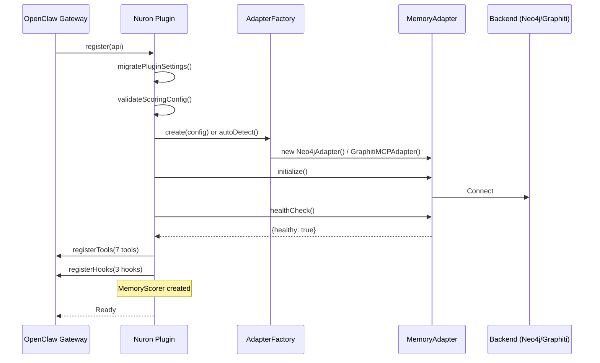
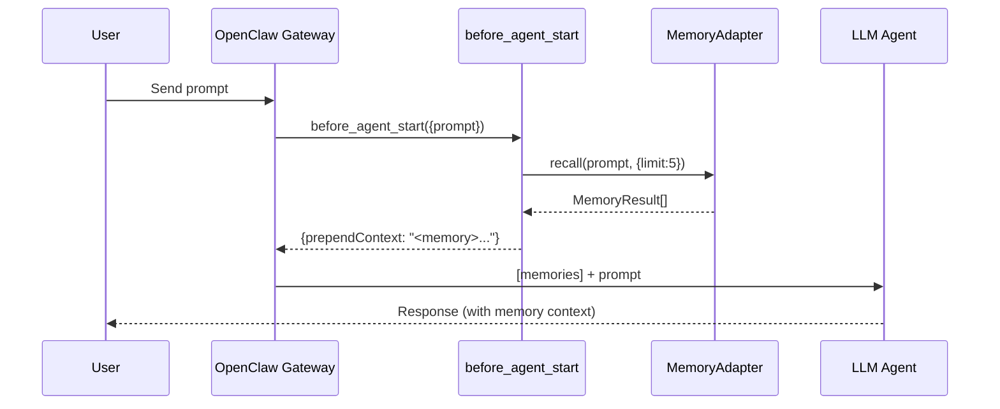
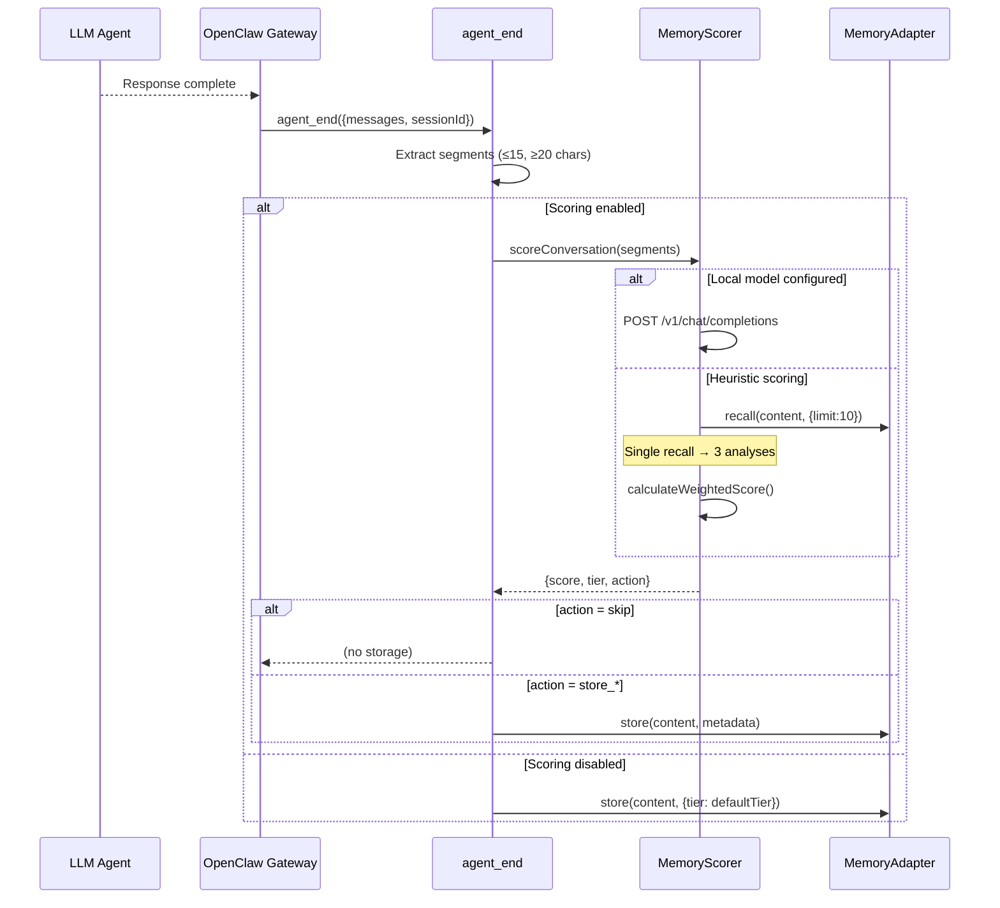
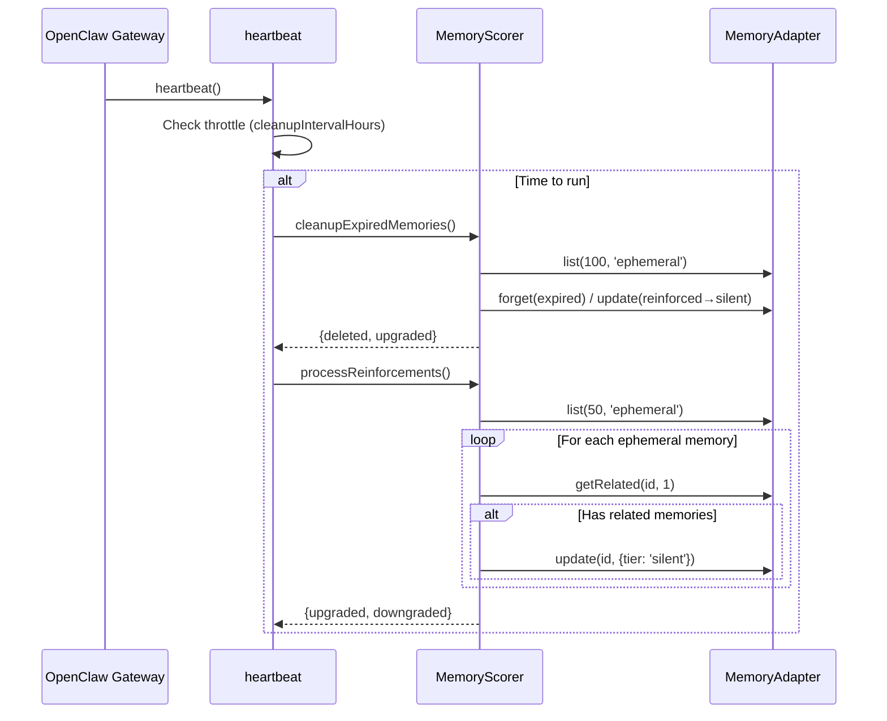
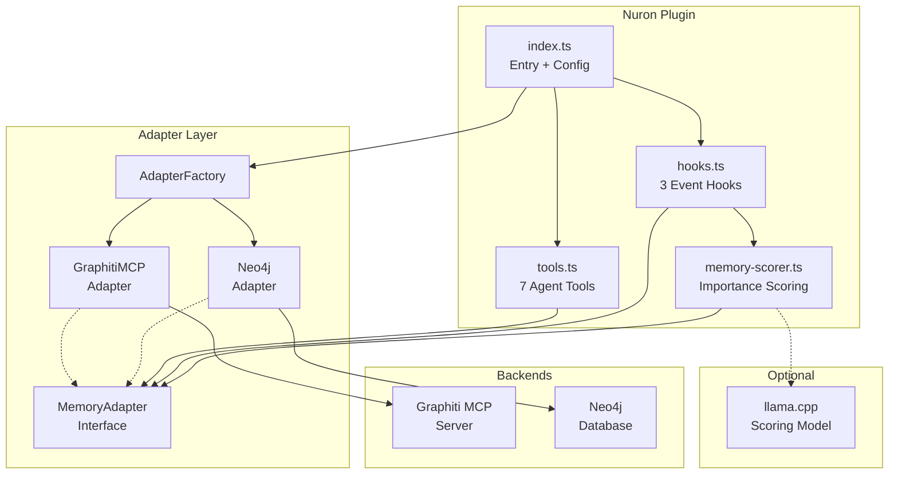

# Nuron — Publishing Guide & Architecture Reference

**Version:** 2.0.0  
**Date:** February 28, 2026

---

## Table of Contents

1. [Publishing to npm](#1-publishing-to-npm)
2. [Installing via OpenClaw](#2-installing-via-openclaw)
3. [Version Management & Git Tags](#3-version-management--git-tags)
4. [Upgrade Workflow (Full Cycle)](#4-upgrade-workflow-full-cycle)
5. [Architecture Overview](#5-architecture-overview)
6. [Execution Path — Step by Step](#6-execution-path--step-by-step)
7. [Mermaid Diagrams](#7-mermaid-diagrams)
8. [Scenarios](#8-scenarios)

---

## 1. Publishing to npm

### 1.1 Prerequisites

```bash
# Ensure you have an npm account and are logged in
npm whoami          # Check current user
npm login           # Login if needed (opens browser for 2FA)

# Ensure the package name is available (scoped packages are always available)
npm view @basuru/nuron   # Should return 404 on first publish
```

### 1.2 Pre-publish Checklist

| Step | Command | Why |
|------|---------|-----|
| Clean build | `rm -rf dist && npm run build` | Ensure dist/ is fresh from current source |
| Type-check | `npx tsc --noEmit` | Catch type errors before publishing |
| Verify entry point | `ls dist/index.js dist/index.d.ts` | Confirm main + types exist |
| Check package contents | `npm pack --dry-run` | Preview what will be published |
| Verify openclaw.plugin.json | `cat openclaw.plugin.json \| python3 -m json.tool` | Ensure valid JSON |
| Run tests (if available) | `npm test` | Don't publish broken code |

### 1.3 First-time Publish

```bash
# 1. Clean build
rm -rf dist && npm run build

# 2. Preview what will be published
npm pack --dry-run

# 3. Publish (scoped packages are private by default, use --access public)
npm publish --access public

# Output will show:
# npm notice @basuru/nuron@2.0.0
# + @basuru/nuron@2.0.0
```

### 1.4 Subsequent Publishes

```bash
# 1. Bump version (pick one)
npm version patch   # 2.0.0 → 2.0.1 (bug fixes)
npm version minor   # 2.0.0 → 2.1.0 (new features)
npm version major   # 2.0.0 → 3.0.0 (breaking changes)

# 2. Build and publish
npm run build && npm publish --access public

# 3. Push version commit + tag to git
git push && git push --tags
```

### 1.5 `.npmignore` (Recommended)

Create this file to exclude dev files from the published package:

```
# Source (dist/ is published, not src/)
src/
config/
docs/
.env*
!.env.example
tsconfig.json
.git/
.github/
STATUS.md
*.md
!README.md
```

Alternatively, use `"files"` in `package.json` (whitelist approach — more secure):

```jsonc
{
  "files": [
    "dist/",
    "openclaw.plugin.json",
    "README.md",
    ".env.example"
  ]
}
```

### 1.6 What Gets Published

```
@basuru/nuron@2.0.0
├── dist/                          # Compiled JS + declarations
│   ├── index.js                   # Plugin entry point
│   ├── index.d.ts
│   ├── hooks.js / hooks.d.ts
│   ├── tools.js / tools.d.ts
│   ├── memory-scorer.js / .d.ts
│   └── adapters/
│       ├── factory.js / .d.ts
│       ├── graphiti-adapter.js / .d.ts
│       ├── neo4j-adapter.js / .d.ts
│       ├── memory-adapter.js / .d.ts
│       └── index.js / .d.ts
├── openclaw.plugin.json           # Plugin manifest (required by OpenClaw)
├── package.json
└── README.md
```

---

## 2. Installing via OpenClaw

### 2.1 Install from npm

```bash
# Install the plugin (downloads from npm, extracts to ~/.openclaw/extensions/nuron/)
openclaw plugins install @basuru/nuron

# Verify installation
openclaw plugins list
openclaw plugins info nuron
```

### 2.2 Configure in OpenClaw

Add to your OpenClaw config (`~/.openclaw/config.yaml` or equivalent):

```yaml
plugins:
  slots:
    memory: "nuron"        # Assign to the memory slot (exclusive — replaces built-in memory)
  entries:
    nuron:
      enabled: true
      config:
        backend: "neo4j"   # or "graphiti-mcp" or "auto"
        neo4j:
          uri: "bolt://localhost:7687"
          user: "neo4j"
          password: "your-password"
        autoCapture: true
        autoRecall: true
        scoringEnabled: true
```

### 2.3 Update an Existing Installation

```bash
# Update to latest
openclaw plugins update nuron

# Update to specific version
openclaw plugins install @basuru/nuron@2.1.0

# Restart gateway after update
openclaw restart
```

### 2.4 Key Difference: npm Install vs Local Build

| Aspect | `openclaw plugins install @basuru/nuron` | Local build + load path |
|--------|------------------------------------------|------------------------|
| Source | npm registry (versioned, immutable) | Local filesystem |
| Dependencies | Installed by OpenClaw (`npm install --ignore-scripts`) | Manual `npm install` |
| Updates | `openclaw plugins update nuron` | Manual rebuild |
| Config tracking | Tracked in `plugins.installs` | Manual `plugins.load.paths` |
| Plugin discovery | Automatic (installed in `~/.openclaw/extensions/`) | Requires explicit path config |
| Reliability | High — consistent, tested packages | May break if workspace changes |

---

## 3. Version Management & Git Tags

### 3.1 Semantic Versioning

```
MAJOR.MINOR.PATCH
  │     │     └── Bug fixes, scoring adjustments
  │     └──────── New features (new adapter, new scoring model, new config options)
  └────────────── Breaking changes (config schema changes, renamed IDs)
```

### 3.2 Git Tag Workflow

```bash
# Tag after npm version bump (npm version auto-creates git tags)
npm version minor       # Creates v2.1.0 tag + commit

# Or tag manually
git tag -a v2.0.0 -m "v2.0.0 — Rename to Nuron, optimize scoring"
git push origin v2.0.0

# List all tags
git tag -l "v*"
```

### 3.3 GitHub Release (Optional)

```bash
# Create release from tag via GitHub CLI
gh release create v2.0.0 --title "Nuron v2.0.0" --notes "Renamed from graphiti-memory, optimized scoring latency"
```

---

## 4. Upgrade Workflow (Full Cycle)

```bash
# 1. Make code changes
# 2. Update version
npm version minor

# 3. Build
npm run build

# 4. Publish
npm publish --access public

# 5. Push to git
git push && git push --tags

# 6. Update in OpenClaw
openclaw plugins update nuron

# 7. Restart gateway
openclaw restart

# 8. Verify
openclaw plugins info nuron
# Check logs for "[nuron] Plugin registered successfully"
```

---

## 5. Architecture Overview

### 5.1 Layer Model

```
┌─────────────────────────────────────────────────────────────────┐
│                      OpenClaw Gateway                           │
│                    (loads plugin at runtime via jiti)            │
├─────────────────────────────────────────────────────────────────┤
│                       NURON PLUGIN                              │
│                                                                 │
│  ┌──────────┐  ┌──────────┐  ┌──────────────┐  ┌───────────┐  │
│  │ index.ts │──│ tools.ts │  │  hooks.ts    │  │  scorer   │  │
│  │ (entry)  │  │ (7 tools)│  │ (3 hooks)    │  │           │  │
│  └────┬─────┘  └────┬─────┘  └──────┬───────┘  └─────┬─────┘  │
│       │              │               │                │         │
│       └──────────────┴───────────────┴────────────────┘         │
│                              │                                   │
│                    ┌─────────┴─────────┐                        │
│                    │  MemoryAdapter    │  (interface)            │
│                    │  interface        │                         │
│                    └─────────┬─────────┘                        │
│                              │                                   │
│              ┌───────────────┼──────────────┐                   │
│              ▼               ▼              ▼                   │
│     ┌──────────────┐  ┌───────────┐  ┌──────────┐             │
│     │ GraphitiMCP  │  │  Neo4j    │  │ (future) │             │
│     │ Adapter      │  │  Adapter  │  │ FalkorDB │             │
│     └──────┬───────┘  └─────┬─────┘  │ SQLite   │             │
│            │                │         └──────────┘             │
└────────────┼────────────────┼──────────────────────────────────┘
             │                │
             ▼                ▼
     ┌───────────────┐  ┌──────────┐
     │ Graphiti MCP  │  │  Neo4j   │
     │ Server (ext)  │  │  DB      │
     └───────────────┘  └──────────┘
```

### 5.2 Module Responsibilities

| Module | Purpose |
|--------|---------|
| **index.ts** | Plugin registration, config validation, adapter creation, lifecycle management |
| **tools.ts** | 7 agent tools: `memory_recall`, `memory_store`, `memory_list`, `memory_forget`, `memory_status`, `memory_consolidate`, `memory_analyze` |
| **hooks.ts** | 3 event hooks: `before_agent_start` (auto-recall), `agent_end` (auto-capture + scoring), `heartbeat` (cleanup) |
| **memory-scorer.ts** | Importance scoring engine (heuristic or LLM-based), conversation gating, tier assignment |
| **adapters/memory-adapter.ts** | Core `MemoryAdapter` interface + types |
| **adapters/graphiti-adapter.ts** | Graphiti MCP backend via `@modelcontextprotocol/sdk` |
| **adapters/neo4j-adapter.ts** | Direct Neo4j Bolt backend |
| **adapters/factory.ts** | Backend auto-detection + creation |

### 5.3 Memory Tier Model

| Tier | Score Range | Lifetime | User Notification | Example |
|------|-------------|----------|-------------------|---------|
| **Explicit** | ≥ 8 | Permanent | Yes — "Got it, noting that" | "Remember I prefer dark mode" |
| **Silent** | 4–7 | 30 days (reinforcement extends) | No | Technical discussion, project details |
| **Ephemeral** | < 4 | 48–72 hours | No | "Hi", "Thanks", trivial questions |

---

## 6. Execution Path — Step by Step

### 6.1 Plugin Startup

1. **OpenClaw Gateway** discovers `@basuru/nuron` in `~/.openclaw/extensions/nuron/`
2. Gateway reads `openclaw.plugin.json` → validates `configSchema` against user config
3. Gateway calls `register(api)` from `dist/index.ts`
4. `register()` runs legacy ID migration (`graphiti` → `graphiti-memory` → `nuron`)
5. `validateScoringConfig()` coerces/clamps threshold values + validates `scoringModel.endpoint` URL
6. **AdapterFactory** creates a `MemoryAdapter` based on `config.backend`:
   - `'auto'` → tries Neo4j env vars → tries Graphiti env vars → tries localhost defaults
   - `'neo4j'` → creates `Neo4jAdapter` directly
   - `'graphiti-mcp'` → creates `GraphitiMCPAdapter` directly
7. `adapter.initialize()` + `adapter.healthCheck()`
8. `registerTools(api, adapter, config)` → registers 7 tools
9. `registerHooks(api, adapter, config)` → registers 3 hooks + creates `MemoryScorer`
10. Plugin is live

### 6.2 Message Flow — Auto-Recall (before_agent_start)

1. User sends a prompt to OpenClaw
2. OpenClaw fires `before_agent_start` event with `{ prompt }`
3. Hook checks: `config.autoRecall` enabled? Prompt long enough?
4. Calls `adapter.recall(prompt, { limit: 5, tier: 'all' })`
5. Formats results as `<memory>` XML block
6. Returns `{ prependContext: "<memory>..." }` → injected before the prompt
7. Agent sees memories as context

### 6.3 Message Flow — Auto-Capture (agent_end)

1. Agent finishes responding → OpenClaw fires `agent_end` event with `{ messages, sessionId }`
2. Hook extracts conversation segments (last 15 messages, ≥20 chars each)
3. Filters out injected `<memory>` blocks
4. If `scoringConfig.enabled`:
   a. Calls `scorer.scoreConversation(segments)`
   b. Scorer checks conversation gating (min length / min messages)
   c. If local scoring model configured → delegates to LLM via `/v1/chat/completions`
   d. Otherwise → single `adapter.recall()` + heuristic scoring (7 factors)
   e. Returns `{ score, tier, reasoning, recommendedAction }`
   f. Hook stores or skips based on `recommendedAction`
5. If scoring disabled: stores with `defaultTier` (configurable)

### 6.4 Message Flow — Tool Call (memory_recall)

1. Agent decides to call `memory_recall` tool with `{ query, limit?, tier? }`
2. `tools.ts` handler normalizes tier, clamps limit
3. Calls `adapter.recall(query, { limit, tier })`
4. Formats results and returns to agent

### 6.5 Scoring Pipeline (Detail)

```
Input: ConversationSegment[]
          │
          ▼
    ┌─────────────────┐
    │ Config enabled?  │──NO──▶ Return {score:6, tier:defaultTier}
    └────────┬────────┘
             │ YES
             ▼
    ┌─────────────────┐
    │ Gating check    │──FAIL──▶ Return {score:2, tier:'ephemeral'}
    │ (minLength,     │          (unless explicit markers found)
    │  minMessages)   │
    └────────┬────────┘
             │ PASS
             ▼
    ┌─────────────────┐
    │ Local model?    │──YES──▶ POST /v1/chat/completions
    │ (llamacpp/      │          Parse JSON → {score, tier, reasoning}
    │  openai)        │          On failure → fall through to heuristics
    └────────┬────────┘
             │ NO / FALLBACK
             ▼
    ┌─────────────────────────────────────┐
    │ Heuristic Scoring                   │
    │                                     │
    │ 1. detectExplicitMarkers()    local │
    │ 2. detectEmotionalContent()   local │
    │ 3. detectTimeSensitivity()    local │
    │ 4. predictFutureUtility()     local │
    │ 5. adapter.recall() ──── SINGLE     │
    │    │                     NETWORK    │
    │    ├─▶ checkRepetitionFromResults() │
    │    ├─▶ checkContextAnchoringFromResults() │
    │    └─▶ checkNoveltyFromResults()    │
    │ 6. calculateWeightedScore()         │
    │ 7. determineTier()                  │
    └─────────────────────────────────────┘
             │
             ▼
    ScoringResult {score, tier, reasoning, recommendedAction}
```

---

## 7. Mermaid Diagrams

### 7.1 Plugin Lifecycle



### 7.2 Auto-Recall Flow



### 7.3 Auto-Capture + Scoring Flow



### 7.4 Heartbeat Cleanup



### 7.5 Component Architecture



---

## 8. Scenarios

### Scenario 1: User says "Remember I prefer dark mode"

```
1. Agent processes message, responds "Got it!"
2. agent_end fires with the conversation
3. Scorer detects explicit markers: "remember", "prefer"
4. Heuristic: explicit_emphasis=10, emotional=2 (preference), future_utility=7
5. Weighted score: 8/10 → tier: explicit
6. Stored with metadata: {tier:'explicit', score:8, source:'auto_capture'}
7. Log: "[nuron] Storing as explicit (high importance)"
8. Next session: user asks about preferences → auto-recall finds this memory
```

### Scenario 2: User says "Hi, how are you?"

```
1. agent_end fires
2. Conversation gating: total length = 16 chars < minConversationLength (50)
3. No explicit markers found
4. Short-circuited → score:2, tier:ephemeral, action:store_ephemeral
5. Stored with 72h expiry
6. Heartbeat cleanup deletes it after 72h
```

### Scenario 3: Scoring disabled (dumb mode)

```
Config: { scoringEnabled: false, scoringDefaultTier: "silent" }

1. agent_end fires
2. scorer.scoreConversation() → fast-path returns {score:6, tier:'silent'}
3. No adapter.recall() call made (zero network overhead)
4. Stored as silent with 30-day lifetime
```

### Scenario 4: Local model scoring (llama.cpp)

```
Config: {
  scoringModel: {
    provider: "llamacpp",
    endpoint: "http://localhost:8080",
    model: "qwen2.5:0.5b"
  }
}

1. agent_end fires
2. Scorer POSTs to http://localhost:8080/v1/chat/completions
3. llama.cpp returns: {"score":7, "tier":"silent", "reasoning":"project discussion"}
4. Scorer validates response, applies tier thresholds
5. Stored as silent
6. If llama.cpp is down → automatic fallback to heuristic scoring
```

### Scenario 5: Repeated information (high repetition)

```
1. User mentions their project name for the 5th time
2. Scorer does adapter.recall() → finds 4 existing memories about this project
3. Repetition score: high (avg similarity 0.8 → repetition=8)
4. Novelty score: low (1 - 0.8 = 0.2 → novelty=2)
5. Context anchoring: high (3 explicit memories about this project)
6. Net effect: moderate score — information is known but context is reinforced
7. Stored as silent (existing explicit memories not duplicated)
```

### Scenario 6: First-time npm install by new user

```bash
# 1. User discovers the plugin
openclaw plugins install @basuru/nuron

# 2. OpenClaw downloads from npm, extracts to ~/.openclaw/extensions/nuron/
# 3. Runs `npm install --ignore-scripts` for dependencies

# 4. User configures
# In ~/.openclaw/config.yaml:
plugins:
  slots:
    memory: "nuron"
  entries:
    nuron:
      enabled: true
      config:
        backend: "neo4j"
        neo4j:
          uri: "bolt://localhost:7687"
          user: "neo4j"
          password: "mypassword"

# 5. Restart gateway
openclaw restart

# 6. Verify
openclaw plugins info nuron
# → Shows: nuron v2.0.0, kind: memory, healthy: true
```

---

## Appendix: OpenClaw Plugin Compliance Checklist

| Requirement | Status | Notes |
|-------------|--------|-------|
| `openclaw.plugin.json` present | ✅ | With `id`, `configSchema`, `kind` |
| `configSchema` has `additionalProperties: false` | ✅ | Added in v2.0.0 |
| `package.json` has `openclaw.extensions` | ✅ | Points to `./dist/index.js` |
| Plugin exports `{ id, name, configSchema, register(api) }` | ✅ | Object-style export |
| `kind: "memory"` for memory slot | ✅ | Enables `plugins.slots.memory` |
| Tool names in `snake_case` | ✅ | `memory_recall`, `memory_store`, etc. |
| Manifest and runtime `configSchema` match | ✅ | Synchronized in v2.0.0 |
| `uiHints` for sensitive fields | ✅ | `neo4j.password`, `scoringModel.apiKey` |
| `legacyIds` for migration | ✅ | `['graphiti', 'graphiti-memory']` |
| Shutdown handler registered | ✅ | Via `api.onShutdown` or `api.on('shutdown')` |
| Entry files are `.js` (compiled) | ✅ | TypeScript compiled to `dist/` |
| No lifecycle scripts in deps | ✅ | `@modelcontextprotocol/sdk`, `@sinclair/typebox`, `neo4j-driver` are all pure JS |
